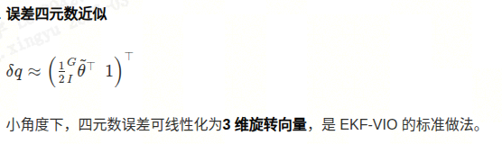

**校准**
* 立体标定（包括两台相机之间的相机内参、畸变和外参）需要使用标定软件
* [Kalibr](https://github.com/ethz-asl/kalibr) 可用于立体标定，并获取立体相机和 IMU 之间的坐标变换。Kalibr 生成的 yaml 文件可以直接在该软件中使用

---
* 机器人必须从静止状态启动才能成功初始化 VIO。
---
**ros节点**
* 订阅的话题/消息 Subscribed Topics
  - `imu` (`sensor_msgs/Imu`)
    - IMU 消息用于特征跟踪和两点 RANSAC 算法中的旋转补偿
  - `cam[x]_image` (`sensor_msgs/Image`)
    - 同步立体图像
- 发布的话题/消息 Published Topics
  - `features` (`msckf_vio/CameraMeasurement`)
    - 记录当前立体图像对的特征测量值
  - `tracking_info` (`msckf_vio/TrackingInfo`)
    - 记录特征跟踪状态，用于调试
  - `debug_stereo_img` (`sensor_msgs::Image`)
    - 在立体图像上绘制当前特征，用于调试。请注意，此调试图像仅在订阅后生成
**vio节点**
* 订阅
  * `imu` (`sensor_msgs/Imu`)  
    * IMU 测量值
  * `features` (`msckf_vio/CameraMeasurement`)
    * 来自 `image_processor` 节点的立体特征测量
* 发布
  * `odom` (`nav_msgs/Odometry`)
    * 包含适当协方差的 IMU 坐标系里程计
  * `feature_point_cloud` (`sensor_msgs/PointCloud2`)
    * 显示地图中用于估计的当前特征
  
---
论文阅读 Robust Stereo Visual Inertial Odometry for Fast Autonomous Flight
* stereo其实可以翻译成 双目? 翻译软件是翻译成立体
* 尤其对于微型飞行器 (MAV) 而言，正确的姿态估计对于保持机器人在空中的稳定至关重要,将来自摄像头的视觉信息与来自惯性测量单元 (IMU) 的测量数据相结合的解决方案，通常被称为视觉惯性里程计 (VIO)，因其在 GPS 信号受限的环境中也能良好运行而广受欢迎，并且与基于激光雷达的方法相比，它只需要一个小型轻便的传感器组件,因此，它是 MAV 平台的首选技术。
* VIO算法的挑战:例如光照条件剧烈变化、光照不均、低纹理场景以及由于阵风或剧烈机动导致的姿态突变。
* 所提出的立体视觉估计方法能够达到与最先进的单目解决方案相当甚至更高的效率(计算成本),
* 首个无需GPU加速即可在笔记本电脑上运行的开源基于滤波器的立体视觉信息采集（VIO）算法;对所提出的S-MSCKF算法与最先进的开源VIO解决方案（包括OKVIS [4]、ROVIO [5]和VINSMONO [6]）进行了详细的实验比较，比较指标包括精度、效率和鲁棒性
* 由于状态向量中四元数存在单位模长约束，直接使用真实 IMU 状态会导致协方差矩阵奇异。因此本文采用IMU 误差状态
> 为什么用误差状态而不用直接状态？四元数有单位约束（∥q∥=1），直接估计会让协方差矩阵奇异。误差状态用3 维小角度表示旋转，无冗余、无约束，适合卡尔曼滤波
* 
* 相机状态与边缘化:状态里缓存N 个历史相机位姿，用于构建多帧约束;缓存满时边缘化旧状态，避免状态维度无限增长，保证实时性
* **A.过程模型,Process modle**
  * 估计的 IMU 状态的连续时间动力学方程为：式(1)
  * IMU 误差状态的线性化连续动力学为:式(2)
  * 为处理离散时间的 IMU 测量，我们用四阶龙格 - 库塔（RK4）对式 (1) 数值积分，完成IMU 状态传播。
  * 为传播状态的不确定性，需先计算式 (2) 的离散状态转移矩阵与离散噪声协方差矩阵
  * IMU 状态的预测协方差;将整体状态协方差分块;完整的不确定性传播可写
  * 当收到新图像时，需要用新相机状态对系统状态进行增广,每来一帧图片，就把当前相机位姿加入状态向量。新相机位姿可由最新 IMU 状态计算;增广后的协方差矩阵为(3)
  * 过程模型 = 用 IMU 做状态预测 + 误差状态线性化 + 离散传播 + 相机状态增广，是 S-MSCKF 滤波的预测步（Predict）
* **B. Measurement Model 测量模型**
  * 虽然状态向量只包含左相机位姿，但右相机位姿可通过标定好的外参直接算出。
  * 如果双目图像已矫正，观测可降到 3 维。但本文用 4 维表示，好处是：不要求左右观测共面，因此不需要做双目矫正。
  * 测量模型 = 双目 4 维观测 + 无矫正 + 路标点最小二乘估计 + 线性化 + 零空间投影 → 标准 EKF 更新
* **C. Observability Constraint 观测约束**
  * 基于 EKF 的 6 自由度（6-DOF）运动估计 VIO存在4 个不可观测方向，对应全局位置（3 维）和沿重力轴的旋转（即偏航角 yaw，1 维）
    * 3 维全局位置：VIO 无法确定 “自己在世界的哪个绝对位置”（只能算相对运动）；
    * 1 维偏航角（yaw）：重力方向能约束 roll/pitch，但无法约束绕重力轴的旋转（比如无人机原地转方向，VIO 无法感知）；
  * 直接（朴素）实现 EKF-VIO 会让偏航角引入虚假信息（spurious information），这是因为：同一时刻下，过程模型与测量模型的线性化点不一致;过程模型（IMU 积分）的线性化点：基于上一时刻的估计值,测量模型（视觉观测）的线性化点：基于当前时刻的估计值,会导致滤波发散
  * 目前有多种维持滤波器一致性的方法:初值估计雅可比 EKF（FEJ-EKF）[23];可观测性约束 EKF（OC-EKF）[28];机器人中心映射滤波器（Robocentric Mapping Filter）[29]
    * 在本文实现中，选择应用 OC-EKF,原因:
      * 与 FEJ-EKF 不同，OC-EKF不高度依赖精准的初始估计值
      * 与 Robocentric Mapping Filter 相比，状态向量中的相机位姿可基于惯性系（而非最新 IMU 系）表示，因此在传播阶段，状态向量中已有相机状态的不确定性不会受最新 IMU 状态不确定性的影响;(相机状态的不确定性	可以理解为 “算法对这个相机位姿的‘怀疑程度’”—— 数值越大，越不确定)
* **D. Filter Update Mechanism 滤波更新机制**
* **E. Image Processing Frontend 图像处理前端**
  * 选用 FAST 角点检测器[31]，核心原因是计算高效;已检测的特征点通过 KLT 光流算法[32] 进行时序跟踪（帧间匹配）
  * 尽管文献 [27] 指出：基于描述子的时序特征跟踪在精度上优于 KLT 方法;基于描述子的方法消耗 CPU 资源远更多，但精度提升微乎其微 → 不符合本文 “低算力、实时性” 的应用需求。
  * 本文同样用 KLT 光流完成双目特征匹配（而非描述子匹配），相比描述子方法进一步节省计算量。
  * 在 20cm 基线 的双目配置下，KLT 跟踪可稳定匹配深度 > 1m 的角点特征（跨双目图像）
  * 图像处理前端实现了两种外点剔除策略:2 点 RANSAC：移除时序跟踪中的外点;环形匹配（参考 [33]）：在 “前一帧 - 当前帧” 双目图像对间执行，进一步剔除特征跟踪、双目匹配步骤中产生的外点。
  * 图像处理前端 = FAST 检测 + KLT 光流（时序 + 双目） + 2 点 RANSAC + 环形匹配外点剔除 → 低算力、高实时、精度够用